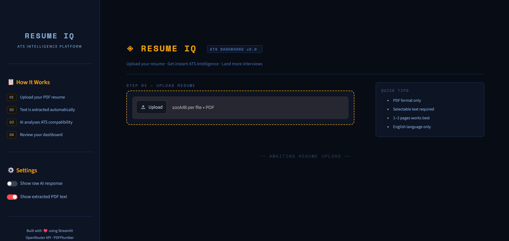
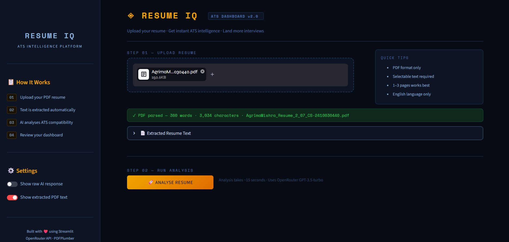
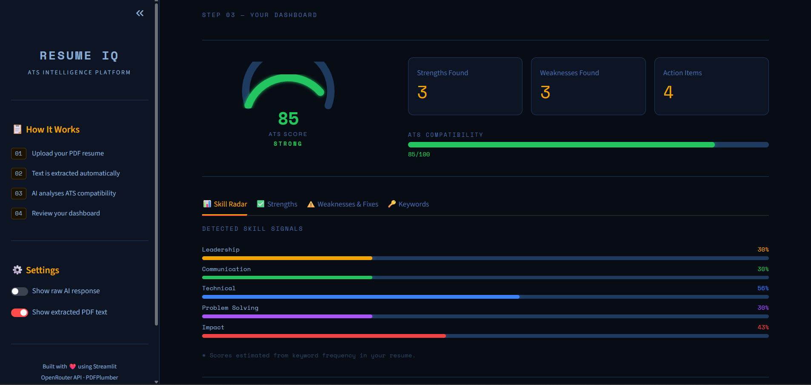

# ResumeIQ — AI-Powered Resume Analysis Dashboard

ResumeIQ is an AI-powered resume analysis platform that helps users evaluate and improve their resumes through ATS (Applicant Tracking System) analysis.

Users can upload a PDF resume and instantly receive an ATS score, strengths, weaknesses, improvement suggestions, skill insights, and keyword analysis through an interactive dashboard.


# Features

## Resume Upload & Parsing

* Upload resumes in PDF format
* Automatic text extraction using PDFPlumber
* Supports multi-page resumes
* Instant resume preview

## AI-Powered Resume Analysis

* ATS Score Generation
* Resume Strength Detection
* Weakness Identification
* Improvement Recommendations
* Resume Quality Assessment

## Interactive Dashboard

* Custom ATS Score Gauge
* ATS Compatibility Progress Bar
* Skill Signal Visualization
* Strength Analysis Cards
* Weakness Analysis Cards
* Actionable Improvement Suggestions
* Keyword Presence Checker
* Optional Raw AI Response View

## Modern User Interface

* Fully customized Streamlit dashboard
* Responsive layout
* Dark futuristic theme
* Interactive tabs and metrics
* Real-time AI analysis progress updates
* Professional dashboard experience


# Tech Stack

## Frontend

* Streamlit
* Custom CSS Styling

## AI Integration

* OpenRouter API
* GPT-3.5 Turbo
* Claude Sonnet 4.6

## PDF Processing

* PDFPlumber

## Backend Utilities

* Requests
* JSON
* Regular Expressions (Regex)
* Math Utilities

## Environment Management

* Python Dotenv

## Development Environment

* Python
* VS Code
* Virtual Environment (venv)


# AI-Assisted Development

This project was developed with the help of modern AI coding assistants to improve development speed, debugging, and UI design.

## AI Tools Used

### ChatGPT

Used for:

* Project planning
* Architecture guidance
* API integration support
* Debugging assistance
* Feature development guidance

### Claude Code

Used for:

* Dashboard UI enhancement
* Streamlit frontend improvements
* Custom CSS styling refinements
* User experience improvements
* Visual dashboard optimization

## Core Contributions were:

* Designed the project workflow
* Built the Streamlit application
* Implemented PDF parsing functionality
* Integrated OpenRouter API
* Developed the ATS analysis pipeline
* Customized the dashboard experience
* Tested and debugged the application
* Refined prompts and analysis outputs

AI tools were used as development assistants while all project decisions, integrations, implementation, testing, and customization were performed by me.


# Project Structure

```bash
ResumeIQ/
│
├── app.py
├── .env
├── requirements.txt
├── README.md
└── venv/
```


# Installation

## 1. Clone the Repository

```bash
git clone https://github.com/your-username/resumeiq.git
cd resumeiq
```

## 2. Create Virtual Environment

```bash
python -m venv venv
```

## 3. Activate Virtual Environment

### Windows

```bash
venv\Scripts\activate
```

### Mac/Linux

```bash
source venv/bin/activate
```

## 4. Install Dependencies

```bash
pip install -r requirements.txt
```


# Environment Variables

Create a `.env` file in the root directory.

```env
OPENROUTER_API_KEY=your_api_key_here
```

Get your API key from:

https://openrouter.ai


# Running the Application

Start the Streamlit server:

```bash
streamlit run app.py
```

The application will launch in your browser automatically.


# Dashboard Outputs

ResumeIQ provides:

### ATS Score

* Overall ATS compatibility score (0–100)

### Strength Analysis

* Highlights positive aspects of the resume
* Identifies strong sections and skills

### Weakness Analysis

* Detects missing information
* Identifies improvement areas

### Suggestions

* Actionable recommendations
* Resume enhancement guidance

### Skill Signals

* Leadership
* Communication
* Technical Skills
* Problem Solving
* Impact

### ATS Keyword Analysis

Checks the presence of common ATS-friendly keywords such as:

* Python
* SQL
* Leadership
* Communication
* Agile
* Cloud
* Machine Learning
* Data Analysis
* Teamwork
* Project Management


# Application Workflow

```text
Upload Resume PDF
        ↓
Extract Resume Text
        ↓
Send Text to OpenRouter AI
        ↓
Generate ATS Analysis
        ↓
Parse AI Response
        ↓
Display Interactive Dashboard
```


# Learning Outcomes

Through this project, I gained practical experience in:

* Streamlit Application Development
* API Integration
* Prompt Engineering
* PDF Processing
* Environment Variable Management
* Error Handling
* Dashboard Design
* AI Application Development
* Frontend Customization
* AI-Assisted Software Development


# Future Improvements

Planned features include:

* Resume vs Job Description Matching
* Resume Rewriter
* Cover Letter Generator
* Interview Question Generator
* Downloadable PDF Reports
* Multi-Model AI Support
* User Authentication
* Cloud Deployment
* Resume Version Tracking
* Personalized Career Recommendations


## Dashboard Preview Screenshots

### Main Dashboard


### Text Extraction


### ATS Analysis



# Author

Agrima Mishra
B.Tech Computer Science Engineering Student